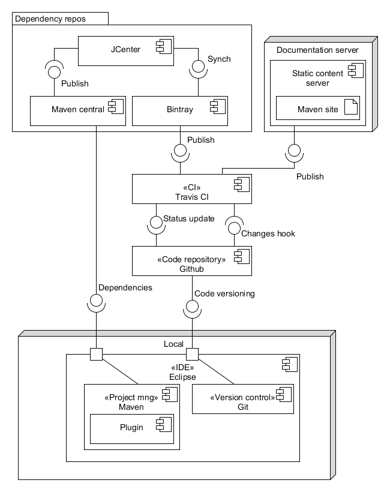

# Java Development Ecosystem

## IDE

Eclipse is the recommended Java [IDE](./ide.md), it integrates with the other tools used, such as Maven or git.

## CI

[Travis](../other/travis.md) is used for [Continuous Integration](./ci.md).

## Project Management

[Maven](../maven/maven.md) is used to manage projects.

## Version control

[git](../other/git.md) is used for version control.

## Deployment to dependency repositories

[Bintray](https://bintray.com), [JCenter](https://bintray.com/bintray/jcenter) and [Maven Central](https://search.maven.org/) are used to [deploy artifacts](./deployment.md).

